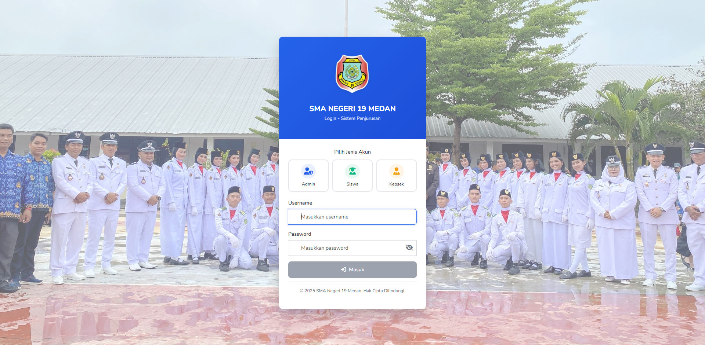
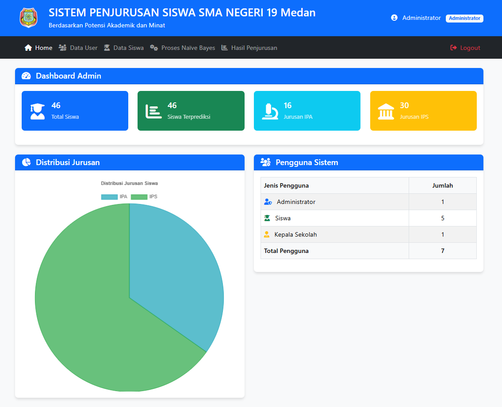
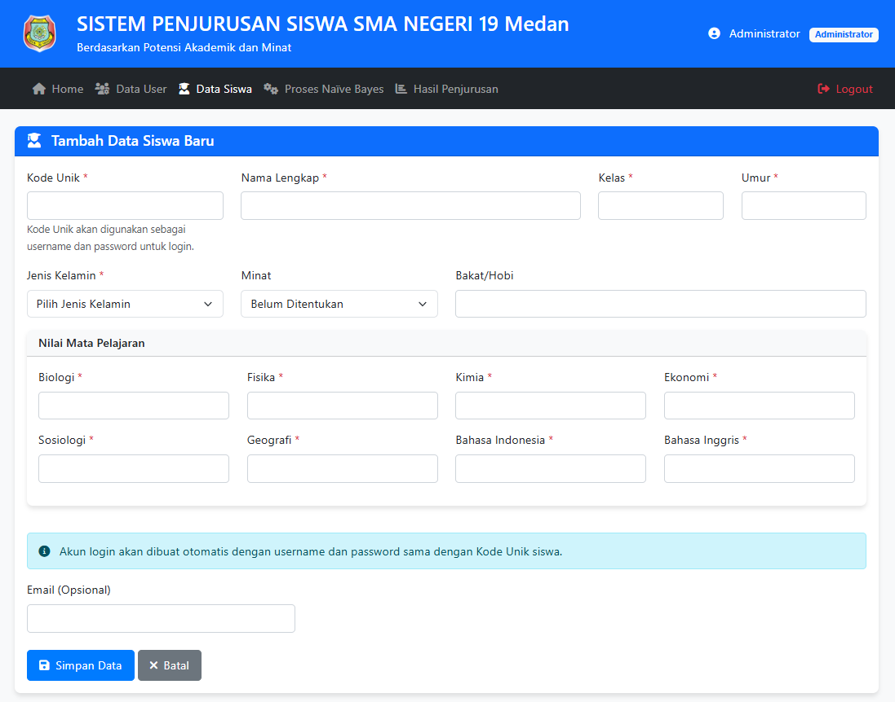
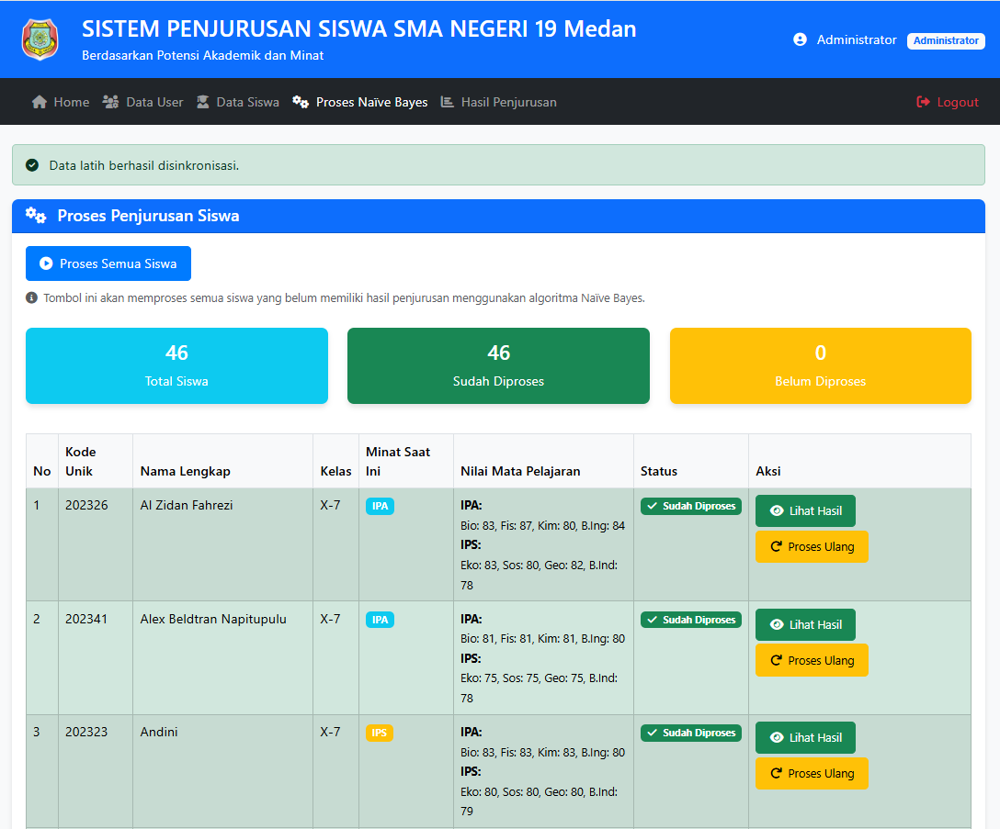
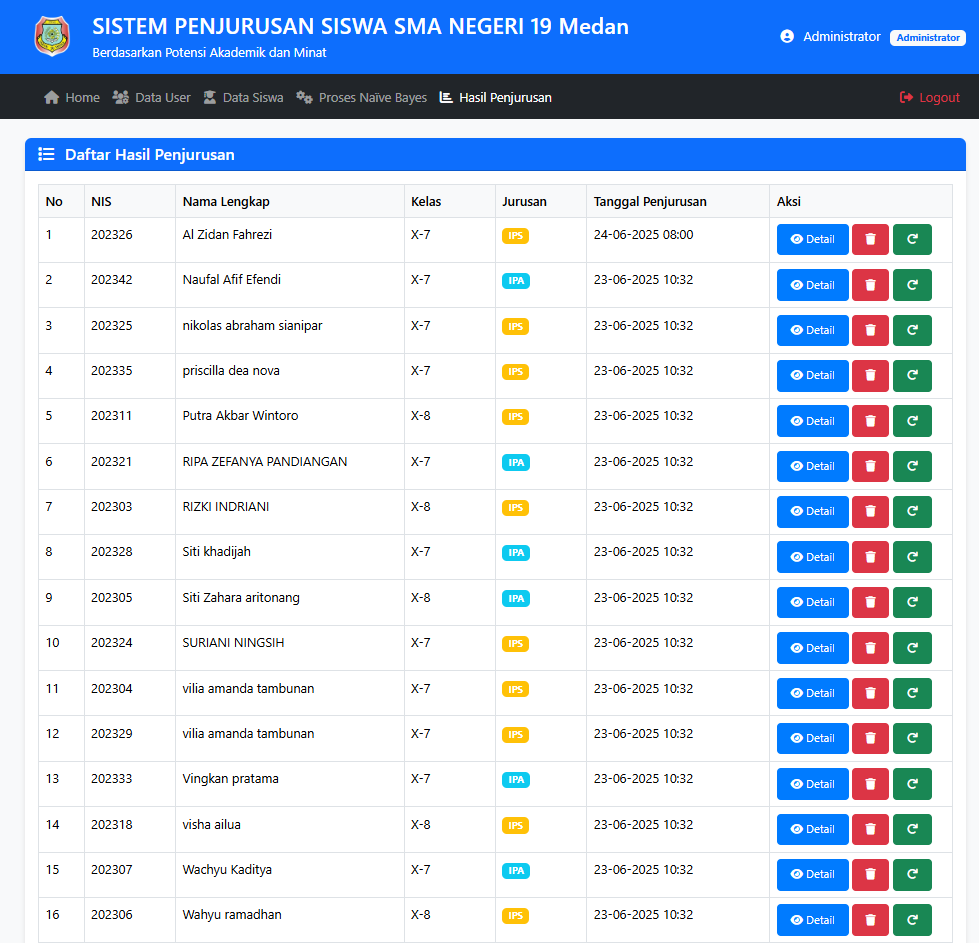

# Sistem Penjurusan SMA dengan Machine Learning

Aplikasi web cerdas untuk membantu siswa SMA menentukan jurusan (IPA/IPS) berdasarkan analisis nilai mata pelajaran menggunakan algoritma Machine Learning Naive Bayes.

## 📸 Screenshots

### 🔐 Halaman Login

*Interface login dengan multi-role access untuk Admin, Siswa, dan Kepala Sekolah*

### 🏠 Dashboard Admin

*Dashboard real-time menampilkan statistik siswa dan distribusi jurusan IPA/IPS*

### 📝 Form Input Data Siswa

*Form input data akademik siswa dengan 8 mata pelajaran dan informasi pribadi*

### ⚙️ Proses Penjurusan

*Interface monitoring proses analisis dengan status tracking untuk setiap siswa*

### 📊 Hasil Prediksi Individual

*Hasil analisis dengan rekomendasi jurusan dan confidence score*

## 📋 Tentang Sistem

Sistem Penjurusan SMA adalah solusi digital yang dirancang khusus untuk membantu proses pemilihan jurusan siswa SMA. Dengan memanfaatkan teknologi Machine Learning, sistem ini memberikan rekomendasi objektif berdasarkan analisis akademik yang mendalam.

### ✨ Fitur Unggulan
- **🎯 Prediksi Cerdas** - Analisis berbasis Machine Learning untuk akurasi tinggi
- **📊 Multi-Role Dashboard** - Interface khusus untuk Admin, Siswa, dan Kepala Sekolah
- **🔍 Analisis Mendalam** - Breakdown detail performance per mata pelajaran
- **📈 Visualisasi Intuitif** - Grafik dan chart yang mudah dipahami
- **💡 Rekomendasi Personal** - Saran pengembangan untuk setiap siswa
- **⚡ Real-time Processing** - Hasil prediksi tersedia secara instant

## 🛠️ Teknologi & Keunggulan

- **Platform**: Modern Web Application
- **Backend**: PHP dengan Object-Oriented Programming
- **Database**: MySQL dengan optimized relational design
- **Machine Learning**: Advanced Gaussian Naive Bayes Algorithm
- **Frontend**: Responsive design (HTML5, CSS3, JavaScript)
- **Security**: Enterprise-grade authentication & session management
- **Performance**: Optimized for high-volume data processing

## 🎯 Metodologi Analisis

### Mata Pelajaran yang Dianalisis:
- **Rumpun IPA**: Biologi, Fisika, Kimia, Bahasa Inggris
- **Rumpun IPS**: Ekonomi, Sosiologi, Geografi, Bahasa Indonesia

### Proses Intelligent Analysis:
1. **Data Collection** - Input nilai mata pelajaran siswa
2. **Machine Learning Processing** - Analisis pola dengan algoritma canggih
3. **Statistical Validation** - Validasi hasil dengan metode statistik
4. **Confidence Scoring** - Pemberian skor kepercayaan hasil
5. **Personalized Recommendation** - Rekomendasi dan saran pengembangan

## 👥 Akses Multi-Role

### 🔧 Administrator
- **Comprehensive Management** - Kelola data siswa dan pengguna sistem
- **Advanced Monitoring** - Real-time tracking proses analisis
- **Analytics Dashboard** - Statistik komprehensif dan trends analysis
- **System Configuration** - Pengaturan dan optimasi sistem

### 👨‍🎓 Siswa
- **Academic Profile** - Input dan update data akademik personal
- **Instant Analysis** - Akses hasil analisis jurusan secara real-time
- **Development Insights** - Rekomendasi pengembangan akademik
- **Progress Tracking** - Monitor perkembangan dan improvement areas

### 👨‍💼 Kepala Sekolah
- **Executive Dashboard** - Overview menyeluruh untuk decision making
- **Distribution Analytics** - Analisis distribusi jurusan siswa
- **Performance Reports** - Laporan performa sistem dan akurasi
- **Strategic Planning** - Data insights untuk perencanaan akademik

## 🚀 Demo & Implementasi

### 💼 Untuk Institusi Pendidikan
Sistem ini telah dirancang khusus untuk kebutuhan sekolah menengah atas dengan fokus pada:
- **Objektivitas** dalam proses penjurusan
- **Efisiensi** waktu dan resources
- **Akurasi** prediksi yang tinggi
- **User Experience** yang intuitif

### 🎓 Manfaat Implementasi

**Untuk Siswa:**
- Keputusan jurusan yang lebih tepat dan objektif
- Pemahaman kelebihan dan area pengembangan
- Panduan fokus pembelajaran yang jelas

**Untuk Sekolah:**
- Proses penjurusan yang terstandarisasi
- Data analytics untuk evaluasi kurikulum
- Efisiensi dalam proses konseling akademik

**Untuk Orang Tua:**
- Transparansi dalam proses pengambilan keputusan
- Insight mendalam tentang potensi akademik anak
- Panduan konkret untuk mendukung pendidikan

## 📱 Responsive & Modern

Sistem dirancang dengan teknologi modern yang mendukung akses melalui:
- ✅ Desktop Computer
- ✅ Laptop & Notebook  
- ✅ Tablet Device
- ✅ Mobile Smartphone

## 🔒 Keamanan & Privasi

- **Data Encryption** - Perlindungan data dengan enkripsi standar industri
- **Secure Authentication** - Sistem login yang aman dan reliable
- **Privacy Protection** - Perlindungan data pribadi siswa
- **Backup System** - Automatic backup dan disaster recovery
- **Access Control** - Role-based access management

## 🏆 Portfolio & Showcase

Sistem ini merupakan showcase dari kemampuan pengembangan:
- **Full-Stack Development** dengan teknologi modern
- **Machine Learning Implementation** dalam pendidikan
- **User-Centered Design** untuk kemudahan penggunaan
- **Scalable Architecture** untuk pertumbuhan data
- **Security Best Practices** untuk perlindungan data

## 👨‍💻 Developer

**M Ferry Dharmawan** https://www.instagram.com/m.ferry_dharmawan/

### Expertise:
- Advanced PHP & MySQL Development
- Machine Learning Algorithm Implementation  
- Web Application Security & Optimization
- Database Design & Performance Tuning
- Modern Frontend Technologies

## 💼 Layanan Profesional

### 🔧 Custom Development Services:
- ✅ **System Customization** - Adaptasi sesuai kebutuhan spesifik sekolah
- ✅ **Implementation Support** - Full installation dan setup assistance
- ✅ **Training Program** - Comprehensive user training dan documentation
- ✅ **Maintenance & Support** - Ongoing technical support dan updates
- ✅ **Feature Enhancement** - Custom feature development
- ✅ **Data Migration** - Transfer data dari sistem existing

### 📞 Konsultasi & Demo

**Available Services:**
- **Free Consultation** - Diskusi kebutuhan sistem sekolah
- **Live Demo** - Demonstration sesuai request
- **Custom Proposal** - Proposal berdasarkan specific requirements
- **Technical Support** - Ongoing support dan maintenance

**Contact for:**
- System demonstration dan consultation
- Custom development requirements
- Implementation planning dan timeline
- Pricing dan service packages

---

**© 2025 Sistem Penjurusan SMA** | *Developed by M Ferry Dharmawan*